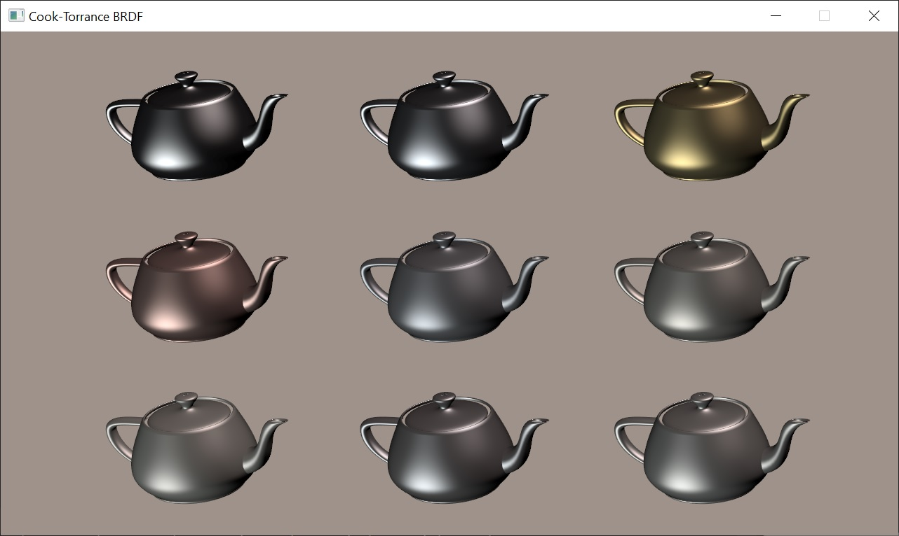
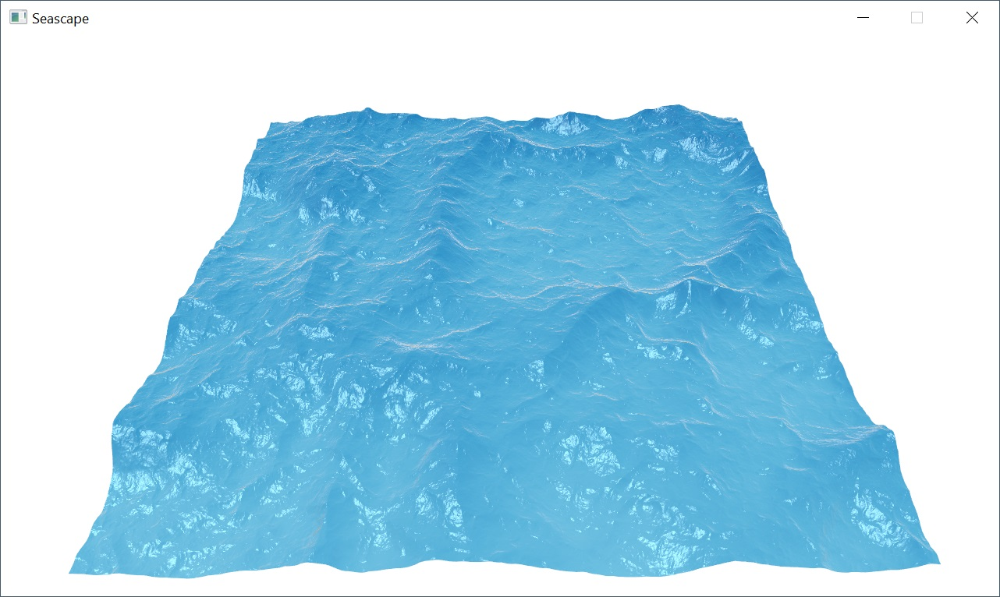

# aggregated-graphics-samples
A collection of exemplary graphics samples based on Magma and Vulkan API

### [BRDF](brdf/)

This demo implements a few basic BRDFs (bidirectional reflectance distribution function) that were used in the early age of computer graphics. BRDF function usually based on the following vectors: surface normal (**n**), light and view vectors (**l, v**) and half vector between them (**h**). First column shows diffuse reflectance models: Lambertian (simple **n.l**), Oren–Nayar and Minnaert. Oren-Nayar model predicts the diffuse reflectance for rough surfaces more accurately than the Lambertian model. Minnaert BRDF was developed to characterize the reflectance of the moon. The second and third teapots of the first row are shaded using Phong reflection model with low and high shininess to simulate metallic and plastic materials, respectively. The Phong reflection model was first published by Bui Tuong Phong in [Illumination for Computer Generated Pictures](https://users.cs.northwestern.edu/~ago820/cs395/Papers/Phong_1975.pdf) (*Graphics and Image Processing, June 1975*). The second and third teapots of the second row are shaded using Blinn-Phong reflection model. It was introduced by James F. Blinn in [Models of Light Reflection for Computer Synthesized Pictures](https://www.microsoft.com/en-us/research/publication/models-of-light-reflection-for-computer-synthesized-pictures/) (*Siggraph, January 1977*). In Phong shading, old hardware have to compute reflected light vector (**r**) and calculate the dot product between a viewer (**v**) and reflected (**r**) vector. In Blinn-Phong model, shininess * 4 will result in specular highlights that very closely match the corresponding Phong reflections. Due to simplicity Blinn–Phong was chosen as the default shading model in OpenGL and Direct3D's fixed-function pipeline. Finally, the second and third teapots of the third row are shaded using anisotropic lighting models. The first one uses precomputed lookup texture (see [Anisotropic Lighting using HLSL](https://download.nvidia.com/developer/SDK/Individual_Samples/DEMOS/Direct3D9/src/HLSL_Aniso/docs/HLSL_Aniso.pdf)) and can be implemented even without fragment shader. The last one uses Ward reflection model. It is a specular-microfacet model with an elliptical-Gaussian distribution function dependent on surface tangent orientation.

### [Cook-Torrance BRDF](cook-torrance/)

Microfacet BRDF was first introduced by Cook and Torrance in [A Reflectance Model for Computer Graphics](https://graphics.pixar.com/library/ReflectanceModel/). They presented a reflectance model for rough surfaces that is more general than Phong or Blinn-Phong BRDF's. Their model predicts the directional distribution and spectral composition of the reflected light. It consists from Fresnel term (F), geometrical attenuation factor (G) and facet slope distribution function (D). For macrosurface Fresnel reflectance usually computed using **n** and **v** vectors, but in a microfacet BRDF the relevant normal direction is the **h** vector, so you have to use cosine between **h** and **v** to compute Fresnel term (see [Background: Physics and Math of Shading](https://blog.selfshadow.com/publications/s2013-shading-course/hoffman/s2013_pbs_physics_math_slides.pdf), p. 47). The original Cook's paper stated that specular equation is F/*π* * DG/((**n**.**l**)(**n**.**v**)). *This is an error* that has been repeated in many places and sometimes π is omitted at all! It has been proved that 4 should be used instead of π (see *Where does that 4 come from, and why isn’t it π?* in [PBR Diffuse Lighting for GGX+Smith Microsurfaces](https://twvideo01.ubm-us.net/o1/vault/gdc2017/Presentations/Hammon_Earl_PBR_Diffuse_Lighting.pdf)). 4 also used in [Physically Based Rendering](https://www.pbrt.org/) (see a [discussion](https://computergraphics.stackexchange.com/questions/3946/correct-specular-term-of-the-cook-torrance-torrance-sparrow-model) about it) so the correct specular BRDF is FDG/(4(**n**.**l**)(**n**.**v**)). Note that denominator should not be zero. Index of refraction is the value of Fresnel reflectance at 0° (reflectance at [normal incidence](https://en.wikipedia.org/wiki/Fresnel_equations#Normal_incidence)). The term F° *is what we call specular color* in physically based shading model. Refractive indices of metallic material tend to vary significantly over the visible spectrum. There are databases like www.filmetrics.com where you can find spectral distribution of complex refractive indices for different metals like Gold and Copper. The spectral distribution of F° needs to be computed and converted into an RGB vector. Fortunately I've found a program for specular color evaluation written by Sébastien Lagarde (see [Feeding a physically based shading model](https://seblagarde.wordpress.com/2011/08/17/feeding-a-physical-based-lighting-mode/)). Also he gathered linear specular values for some metals, which I used to feed Cook-Torrance BRDF. How about the energy conservation between the diffuse term and specular term? Cook and Torrance defined diffuse term as Rd = F°/*π*. Some implementations compute trade-off between diffuse and specular term as 1-F(f°), where Fresnel reflectance calculated using cosine between either **h** and **v** or **n** and **l** vectors. Ashikhmin and Shirley proposed a more complex and accurate approach (see [An Anisotropic Phong Light Reflection Model](https://pdfs.semanticscholar.org/808d/048d4331cf5dac5fd924b50249b7915c6d73.pdf), equation 14), which I used by default. All computations are performed in linear space and final result is gamma corrected using sRGB framebuffer.

### [Bump mapping](bumpmapping/)

Bump mapping was first introduced by James F. Blinn in [Simulation of Wrinkled Surfaces](https://www.microsoft.com/en-us/research/publication/simulation-of-wrinkled-surfaces/) (*SIGGRAPH '78: Proceedings of the 5th annual conference on Computer graphics and interactive techniques, August 1978*). He presented a method of using a texturing function to perform a small perturbation of the surface normal before using it in the lighting calculation. Height field bump map corresponds to a one-component texture map discretely encoding the bivariate function (see [A Practical and Robust Bump-mapping Technique forToday’s GPUs](https://www.researchgate.net/publication/2519643_A_Practical_and_Robust_Bump-mapping_Technique_for_Today's_GPUs)). Because of this, the best way to store height map is to use **BC4** unsigned normalized format (former ATI1/3Dc+). Usually micro-normal is computed from height map in fragment shader using finite differences and only three texture samples, but this may result in aliasing. This demo uses [Sobel filter](https://en.wikipedia.org/wiki/Sobel_operator) with eight texture samples to approximate normal with better precision. After micro-normal is computed, it is transformed from texture space to object space using per-pixel TBN matrix, described in [Normal Mapping without Precomputed Tangents](http://www.thetenthplanet.de/archives/1180) (*ShaderX 5, Chapter 2.6, pp. 131 – 140*). This allows to get rid of computing tangents for each vertex. Finally, normal transformed from object space to view space using so-called [Normal Matrix](https://www.lighthouse3d.com/tutorials/glsl-12-tutorial/the-normal-matrix/). Lighting is computed as dot product of the normal vector with light vector, reproducing **DOT3_RGB** [texture combiner operation](https://www.khronos.org/registry/OpenGL/extensions/EXT/EXT_texture_env_dot3.txt) of old fixed-function hardware.

### [Normal mapping](normalmapping/)

Normal mapping is the most common variation of bump mapping. Instead of computing micro-normal from height map, pre-computed normal map is used. This demo uses normal map stored in two-component **BC5** signed normalized format (former [ATI2/3Dc](https://en.wikipedia.org/wiki/3Dc)) because for normal is it enough to store only X and Y coordinates. Z coordinate of unit vector is reconstructed in fragment shader. Despite this, normal map required twice the VRAM space in comparison to one-component height map. Nevertheless, backed normals have superior quality and require only one texture sample in comparison to three or eight texture samples required for height map.

### [Displacement mapping](displacement-mapping/)

Displacement mapping was first introduced by Robert L. Cook in [Shade Trees](https://graphics.pixar.com/library/ShadeTrees/paper.pdf) (*Computer Graphics, vol. 18, no. 3, July 1984*). Displacement mapping is a method for adding small-scale detail to surfaces. Unlike bump mapping, which affects only the shading of surfaces, displacement mapping adjusts the positions of surface elements. This leads to effects not possible with bump mapping, such as surface features that occlude each other and non-polygonal silhouettes. The drawback of this method is that it requires a lot of additional geometry. Displacement map stored in **BC3** format (former DXT5): normal in RGB components and height in alpha. Vertex displacement performed in the vertex shader. Heightmap sampled in the vertex shader and normal map sampled in the fragment shader. The latter computes not just diffuse lighting, but Phong BRDF to highlight bumps and wrinkles. You can change the displacement amount to see how it affects torus shape.

### [Self-shadowing](self-shadowing/)

Geomentry normal or micro-normal can create self-shadowing situations. There are situations where the perturbed normal is subject to illumination based the light direction. However, the point on the surface arguably should not receive illumination from the light because the unperturbed normal indicates the point is self-shadowed due to the surface’s large-scale geometry. Without extra level of clamping, bump-mapped surfaces can show illumination in regions of the surface that should be self-shadowed based on the vertex-specified geometry of the model. To account for self-shadowing due to either the perturbed or unperturbed surface normal, a special step function is introduced (see [A Practical and Robust Bump-mapping Technique for Today’s GPUs](https://www.researchgate.net/publication/2519643_A_Practical_and_Robust_Bump-mapping_Technique_for_Today's_GPUs), *2.4.1 Bumped Diffuse Self-shadowing*). Step function uses a steep linear ramp to transition between 0 and 1 with coefficient=1/8, which is effective at minimizing popping and winking artifacts. You can toggle self-shadowing on and off to see how step function affects lighting.

### [G-buffer](gbuffer/)

Geometric Buffers was first introduced by Saito and Takahashi in [Comprehensible Rendering of 3-D Shapes](https://www.cs.princeton.edu/courses/archive/fall00/cs597b/papers/saito90.pdf) (*Computer Graphics, vol. 24, no. 4, August 1990*). G-buffers preserve geometric properties of the surfaces such as depth or normal. This demo implements G-buffers as multi-attachment framebuffer that stores depth, normal, albedo and specular properties. Normals are encoded into RG16 floating-point format texture using Spheremap Transform (see [Compact Normal Storage for small G-Buffers](https://aras-p.info/texts/CompactNormalStorage.html)). Normals from normal map transformed from texture space to world space using per-pixel TBN matrix, described in [Normal Mapping without Precomputed Tangents](http://www.thetenthplanet.de/archives/1180) (*ShaderX 5, Chapter 2.6, pp. 131 – 140*).

### [Deferred shading](deferred-shading/)

Deferred shading was proposed by Deering et al. in [The triangle processor and normal vector shader: a VLSI system for high performance graphics](https://dl.acm.org/doi/abs/10.1145/378456.378468) (*Computer Graphics, vol. 22, no. 4, August 1988*). It normally consists from two passes:

* Positions, normals and surface attributes like albedo and specular are written into G-buffer.
* Fragment shader computes lighting for each light source, reconstructing position and normal from G-buffer as well as surface parameters for BRDF function.

This implementation performs additional depth pre-pass, in order to achieve zero overdraw in G-buffer. Writing geometry attributes usually requires a lot of memory bandwidth, so it's important to write to G-buffer only once in every pixel. First, depth-only pass writes depth values into G-buffer with *less-equal* depth test enabled. Second, G-buffer pass is performed with depth test enabled as *equal*, but depth write disabled. In Vulkan, for each pass we have to create separate color/depth render passes in order to clear/write only particular framebuffer's attachment(s). To simplify code, deferred shading is performed for single point light source.

### [Seascape](seascape/)

This demo is an extension of the [vertex texture fetch](vertex-texture-fetch/). In addition to displacement mapping, it performs water shading based on [Beer–Lambert law](https://en.wikipedia.org/wiki/Beer%E2%80%93Lambert_law). First, seabed is represented algebraically as plane in view space. Then two distances on the ray from eye point are computed: distance to intersection point of the ray and plane and distance to water surface. Absorption length gives us an attenuation of the light that is travelled through the water, it could be interpreted as refracted color of the water. Next, the reflection of incident vector and surface normal is computed using *reflect()* function, it's used to lookup reflected color in cubemap texture. Then reflected and refracted colors are mixed using [Schlick's approximation](https://en.wikipedia.org/wiki/Schlick's_approximation) of Fresnel reflectance. Finally, specular reflection from directional light is computed and added to the soup.

### [Shadow mapping](shadowmapping/)

Shadow mapping was first introduced by Lance Williams in [Casting curved shadows on curved surfaces](http://cseweb.ucsd.edu/~ravir/274/15/papers/p270-williams.pdf), (*Computer Graphics, vol. 12, no. 3, August 1978*). First, shadow caster is rendered to off-screen with depth format. In second pass, shadow is created by testing whether a pixel is visible from the light source, by doing comparison of fragment's depth in light view space with depth stored in shadow map.
   

### [Percentage closer filtering](shadowmapping-pcf/)

Percentage closer filtering of shadow map. The technique was first introduced by Reeves et al. in [Rendering Antialiased Shadows with Depth Maps](https://graphics.pixar.com/library/ShadowMaps/paper.pdf) (*Computer Graphics, vol. 21, no. 4, July 1987*). Unlike normal textures, shadow map textures cannot be prefiltered to remove aliasing. Instead, multiple depth comparisons are made per pixel and averaged together. I have implemented two sampling patterns: regular grid and Poisson sampling. This particular implementation uses *textureOffset()* function with constant offsets to optimize URB usage (see [Performance tuning applications for Intel GEN Graphics for Linux and SteamOS](http://media.steampowered.com/apps/steamdevdays/slides/gengraphics.pdf)). Due to hardware restrictions, texture samples have fixed integer offsets, which reduces anti-aliasing quality.

### [Poisson shadow filtering](shadowmapping-poisson/)

Soft shadow rendering with high-quality filtering using [Poisson disk sampling](https://sighack.com/post/poisson-disk-sampling-bridsons-algorithm).
To overcome hardware limitations, *textureOffset()* function was replaced by *texture()*, which allows to use texture coordinates with arbitrary floating-point offsets. To get rid of pattern artefacts I have implemented jittered sampling. For each fragment *noise()* function generates pseudo-random value that is expanded in [0, 2π] range for an angle in radians to construct rotation matrix. Jittered PCF samples are computed by rotating Poisson disk for each pixel on the screen.
  

### [Stable Poisson shadow filtering](shadowmapping-poisson-stable/)

In previous implementation Poisson jittering depends on screen position of the fragment. As neighboring fragments have random noise values, they define different rotation matrices. This causes shadow flickering from the filter pattern when shadow or camera is moving. In this demo I use a jitter pattern which is stable in world space. This means the random jitter offset depends on the world space position of the shadowed pixel and not on the screen space position. You can toggle between screen space and world space techniques to see how shadow filtering changes.

### [Vertex texture fetch](vertex-texture-fetch/)

Vertex texture fetch was first instroduced by NVIDIA with [Shader Model 3.0](http://download.nvidia.com/developer/presentations/2004/GPU_Jackpot/Shader_Model_3.pdf). Traditionally only fragment shader could have access texture, but later vertex and other programmable stages become able to do texture reads. This allows you, for example, read the content of a texture and displace vertices based on the value of texture sample. This demo implements displacing of grid mesh in the vertex shader using dynamically generated height map. Grid mesh is constructed as triangle strip, using primitive restart feature to break up strips. To optimize grid rendering, vertex indices are limited to unsigned short values and vertex's X,Z coordinates are quantized to half floats. To reconstruct normals from height map, I used [Sobel filter](https://en.wikipedia.org/wiki/Sobel_operator). Normally it requires 8 texture samples, but taking into account that vertex shader could access only single mip level and height map stores single scalar values, shader can utilize *textureGatherOffsets()* function to fetch four height values at once, thus limiting reconstruction to only two texture reads. Reconstructed normal are considered to be in object space, therefore TBN matrix isn't needed.

### [Debug tangents](debug-tangents/)

This demo shows two useful applications of a geometry shader. First, it allows to draw wireframe meshes without using line rasterization primitive. Instead, geometry shader is inserted between vertex and fragment stages to supply additional barycentric attribute for each triangle's vertex. Interpolated barycentric values are used to calculate distance from current fragment to the triangle edge and use it as color alpha in normal blending. In this way we can render mesh in wireframe mode with superior quality without MSAA enabled. Second, geometry shader can be utilized to visualize normals and tangents. For this, geometry shader accepts triangle as input primitive but outputs line strip primitive. For each triangle we consider only the first vertex. Simply adding normal vector to vertex's coordinate, we can define endpoint of the line. In this demo vertex buffer doesn't provide tangent vectors, so I computed them directly in the geometry shader using input positions and texture coordinates.

### [Edge detection](edge-detection/)

The Sobel operator, sometimes called the Sobel–Feldman operator or Sobel filter, is used in image processing and computer vision, particularly within edge detection algorithms where it creates an image emphasising edges. Normally Sobel filter requires eight texture reads, but we can optimize it under certain circumstances. If it's enough to read only single value instead of multiple values and we don't need texture filtering, we can use *textureGatherOffsets()* function to gather four scalar values from different locations inside limited offset range (this range is restricted by the size of hardware texture cache). This demo implements exactly this scenario: Sobel filter with two texture gather reads to find depth discontinuities in the depth buffer. The result gradient magnitude is passed to the *step()* function with some edge threshold to emphasise silhouettes of the objects.
